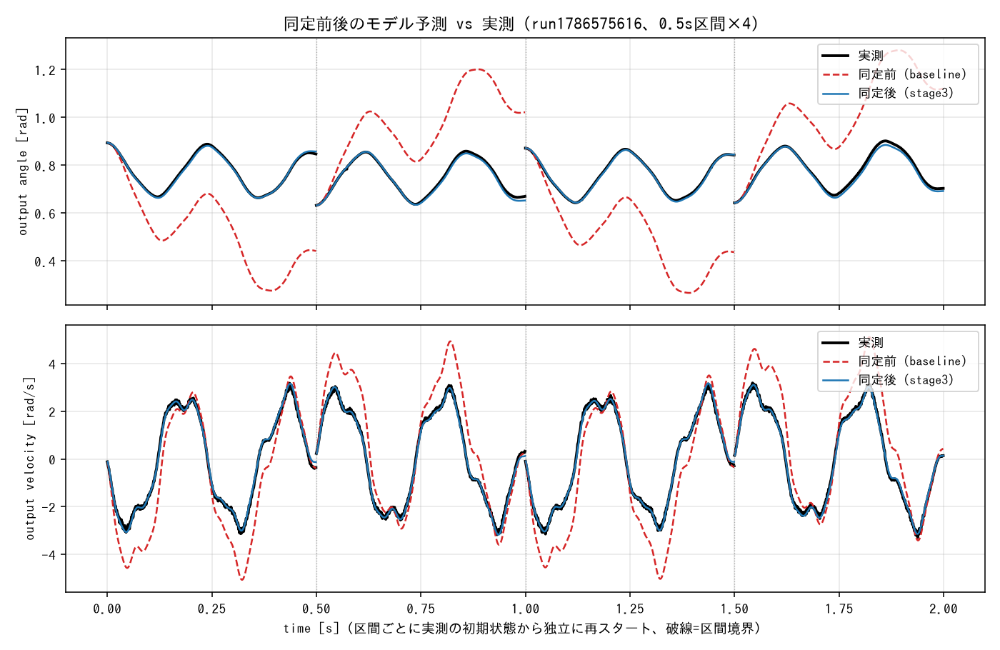
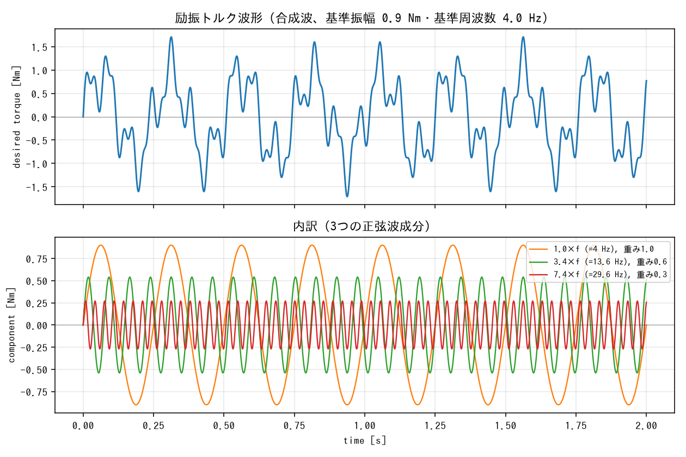

# AK45-36 × MuJoCo システム同定（sysid）ガイド

> **このディレクトリで何をやっているのか、初めての人がこれ1つ読めば分かる**ことを目的にした総合ガイドです。
> 実際の作業チェックリストは [`docs_syid/AK45-36_sysid_作業手順.md`](docs_syid/AK45-36_sysid_作業手順.md)、
> 個々の変更の経緯は [`../../.ai/logs/`](../../.ai/logs/) にあります。

---

## 0. 3行まとめ

1. 実機のモーター **AK45-36** を揺らして、その反応（位置・速度）を記録する。
2. MuJoCo（物理シミュレータ）上に同じモーターの模型を作り、**実機と同じ動きをするようにパラメータを自動調整**する。
3. 得られたパラメータ入りのモデルがあれば、**実機を回さずにPC上で制御則を試せる**ようになる。

現時点の成果（同定済みモデル）は [`models/ak45_36_joint_identified.xml`](models/ak45_36_joint_identified.xml) です。
未同定のモデルで位置誤差 265 mrad だったものが、**11.6 mrad（約23分の1）** まで改善しています。



*赤破線＝同定前（`armature=0.01`/`damping=0`/`frictionloss=0` の初期値のまま）、
青実線＝同定後（フェーズ3ステージ3）、黒実線＝実機の実測値。
実データ（`run1786575616`）に対する0.5秒区間4本の予測で、同定前は実測から大きく外れているのに対し、
同定後はほぼ重なっている。区間の境目（縦の点線）で予測が実測の初期状態にリセットされているのは、
「なぜ軌道を0.5秒に分割するのか」（フェーズ3）で説明する開ループの初期状態鋭敏性への対応。
[`identification/plot_results.py`](identification/plot_results.py) で再生成できる。*

---

## 1. そもそも「システム同定」とは何か

### 1-1. ひとことで言うと

**実物の振る舞いを説明できるように、数式モデルの中の未知の数字を実測データから決めること**です。

シミュレーションをやりたいとき、モデルの「形」（運動方程式）は物理法則から書けます。しかし
その中に出てくる係数 — 慣性はいくつか、摩擦はどれくらいか — は、カタログを見ても正確には
分かりません（個体差もあります）。そこで:

```
    実機に「入力」を与える  →  「出力」を測る
                                    ↓
    シミュレータに同じ「入力」を与える  →  「出力」を計算する
                                    ↓
    2つの出力の差（残差）が最小になるようにパラメータを動かす
```

これがシステム同定です。機械学習でいう「学習」とほぼ同じ発想ですが、**モデルの構造が
物理法則で決まっている**点が違います。だから同定されるのはブラックボックスの重みではなく、
「慣性 = 0.0127」のような物理的に意味のある少数の数字になります。

### 1-2. 今回同定している3つのパラメータ

対象は AK45-36 の1関節（出力軸）です。運動方程式はおおよそこう書けます:

```
    τ  =  J·a  +  b·v  +  c·sign(v)
    ↑     ↑       ↑        ↑
   トルク  慣性   粘性摩擦  クーロン摩擦
```

| MuJoCoでの名前 | 物理的な意味 | イメージ |
|---|---|---|
| `armature` | 慣性（回転させにくさ） | 重いフライホイールほど大きい。**加速度**に比例する抵抗 |
| `damping` | 粘性摩擦 | 水あめの中で回すような抵抗。**速度**に比例する（速いほど強い） |
| `frictionloss` | クーロン摩擦（乾性摩擦） | 錆びた蝶番のような抵抗。**速度によらず一定**の大きさで、向きだけ逆になる |

「`armature`（アーマチュア）」という名前が慣性を指すのは MuJoCo 固有の用語です。
本来は「モーターのロータが持つ慣性が、ギアを通して関節側から見えたときの見かけの慣性
（**反射慣性**）」を表す項で、ギア比の2乗倍されて効きます。AK45-36 はギア比36:1なので、
ロータ自身の慣性の 36² = 1296 倍が関節側から見えることになります。

### 1-3. なぜモーター単体でわざわざやるのか

将来この AK45-36 を使って**ワイヤー駆動の四足ロボット**を作る計画があり
（[`../docs_mechanism/`](../docs_mechanism/) 参照）、その制御則をシミュレータ上で設計したいためです。
シミュレータのモーターがデタラメな摩擦・慣性を持っていると、そこで調整したゲインは実機で
まったく機能しません。**土台となる1関節を正確に合わせておく**のがこの作業です。

---

## 2. ハードウェアと役割分担

実機（CAN通信）は Raspberry Pi でしか扱えず、一方 sysid の最適化計算は重いので母艦の
Windows PC で行います。**受け渡しは git リポジトリ経由**です。

```
  ┌─────────────────────────┐          ┌──────────────────────────┐
  │  Raspberry Pi           │          │  Windows PC              │
  │  ─────────────          │          │  ────────────            │
  │  ・CAN HAT + AK45-36    │  git     │  ・MuJoCoモデル作成       │
  │  ・励振データ取得        │ ───────> │  ・パラメータ最適化       │
  │  ・自動品質チェック      │ commit   │  ・交差検証              │
  │                         │  & pull  │                          │
  │  data/raw/ に出力 ──────┼──────────┼──> identification/ が読む │
  └─────────────────────────┘          └──────────────────────────┘
```

> **補足**: 当初「PC側を使う理由はGPU」としていましたが、これは誤りでした。sysid の最適化は
> 有限差分ヤコビアンによる Gauss-Newton/LM 法で、**GPUは不要**です（`mujoco.rollout` が
> CPUスレッド並列で回します）。PC側を使う実質的な利点は「CPUコア数が多い」「Piの実機制御を
> 止めずに解析できる」の2点です。

### なぜ `data/raw/` に直接書くのか

通常の実験ログ置き場である `my_ak45/control_mit_can/logs/` は `.gitignore` で `*.csv` を
除外しているため、そこに置くと**PC側に届きません**。そのため sysid の実験スクリプトだけは
`.gitignore` の無い `my_ak45/Mujoco/data/raw/` に直接出力するようになっています。

---

## 3. ディレクトリ早見表

```
my_ak45/Mujoco/
├── README.md                    ← いまこれ
├── data_collection/             【Piで動かす】実機データ取得
│   ├── exp_005_sysid_excitation.py   励振信号を送ってCSVに記録する本体（同定用）
│   ├── exp_008_validation_trajectory.py         別軌道の取得（単発）
│   ├── exp_009_validation_trajectory_randomized.py  別軌道の取得（条件ランダム・複数試行）
│   ├── sysid_run_check.py            同定用データの品質を11項目で自動判定
│   └── validation_run_check.py       別軌道データの品質を9項目+実行全体で自動判定
├── data/raw/                    【git追跡】取得された生ログ（CSV + console.log）
│   ├── exp005_sysid_excitation_<timestamp>/
│   └── exp009_validation_trajectory_randomized_<timestamp>/
├── models/                      MuJoCoモデル（XML）
│   ├── ak45_36_joint.xml             ベースライン（同定前。書き換え禁止）
│   └── ak45_36_joint_identified.xml  ★成果物：同定値を焼き込んだモデル
├── identification/              【PCで動かす】同定と検証
│   ├── csv_adapter.py                実機CSV → mujoco.sysid 形式への変換
│   ├── identify.py                   パラメータ最適化の本体
│   ├── validate.py                   交差検証（同定と同じ multi-sine 励振の別ラン）
│   ├── validate_trajectory.py        別軌道での検証（exp_009 インピーダンス追従）
│   └── results/                      同定結果（params.yaml / summary.txt）
└── docs_syid/                   作業手順書・参考資料
    └── AK45-36_sysid_作業手順.md      ★作業チェックリスト（進捗の真実はここ）
```

---

## 4. 作業の全体フロー（5フェーズ）

| フェーズ | 内容 | 場所 | 状態 |
|---|---|---|---|
| **1** | 実機データ取得 | Pi | ✅ 採用3ラン取得済み |
| **2** | MuJoCo最小モデル作成 | PC | ✅ 完了 |
| **3** | パラメータ同定（最適化） | PC | ✅ 完了 |
| **4** | validation（交差検証＋別軌道検証） | PC | ✅ 完了 |
| **5** | 結果をモデルに反映 | PC | ✅ 完了 |

以下、各フェーズで「何をして、なぜそうしたか」を説明します。

---

### フェーズ1: 実機データ取得【Pi】

#### 何をするか

`exp_005_sysid_excitation.py` を実行すると、モーターに **multi-sine（多重正弦波）** の
トルク指令を送り、1kHz で 10.25秒間、位置・速度・電流・トルク・温度を CSV に記録します。

```python
torque(t) = 0.9 * ( sin(2π·4.0·t) + 0.6·sin(2π·13.6·t) + 0.3·sin(2π·29.6·t) )
```

- 基準周波数 4.0 Hz に、3.4倍（13.6 Hz）と 7.4倍（29.6 Hz）の高調波を重ねた波形
- 瞬時最大トルクは 0.9 × (1.0+0.6+0.3) = **1.71 Nm**



*上段が実際にモーターへ送られる合成波形、下段がその内訳（3つの正弦波成分）。
周波数の異なる成分を重ねることで、下記のとおり低速域と高速域で別々の物理特性を分離できる。*

#### なぜ multi-sine なのか

**1つの周波数だけで揺らすと、慣性と摩擦を区別できない**からです。ある周波数での応答を
説明できるパラメータの組み合わせは無数にあり、「慣性が大きくて摩擦が小さい」モデルと
「慣性が小さくて摩擦が大きい」モデルが同じ応答を出してしまいます（**識別不能**という）。

低速域では摩擦が支配的、高速域では慣性が支配的、というように周波数によって効く項が変わるため、
**複数の周波数を同時に混ぜる**ことで両者を分離できます。倍率が 3.4 / 7.4 と半端な数なのは、
整数倍にすると波形が周期的に重なって実質的な情報量が減るのを避けるためです。

#### なぜ「純トルク指令（開ループ）」なのか

`kp = kd = 0` にして、位置や速度のフィードバックを一切かけていません。フィードバックが
あると、観測される動きは「モーターの物理」と「制御則」が混ざったものになり、モーター単体の
特性を取り出せないためです。

> ⚠️ **このため、このスクリプトは本ワークスペースで唯一「復元力を持たない」実験です。**
> モーターが速度を乗せて暴走するリスクがあるため、(1) 指令段階でのトルククランプ、
> (2) 実測値ベースの `SafetyMonitor` による緊急停止、の2層で保護しています。
> それでも初回は必ず目視監視のもとで実行してください。

#### 自動品質チェック（`sysid_run_check.py`）

実験の最後に自動で走り、**11項目**を PASS / WARN / FAIL で判定します。

| # | 項目 | 何を見ているか |
|---|---|---|
| 1 | 取得の完全性 | サンプル数が期待値どおりか |
| 2 | 速度飽和 | 無負荷速度に近づいていないか |
| 3 | トルク線形性 | 速度帯によって実測/指令比が変わっていないか |
| 4 | 符号反転 | 指令と実測でトルクの向きが逆転していないか |
| 5 | 飽和の原因判別 | 電流制限か、逆起電力（電圧）制限か |
| 6 | 遅れ（相互相関） | 指令と実測が何サンプルずれているか |
| 7 | 周波数応答 | ゲイン K・時定数 T・むだ時間 L への分解 |
| 8 | 速度デコード健全性 | 速度の値が位置の微分と整合しているか |
| 9 | 起動過渡 | 開始直後の異常な高速域がどこまで続くか |
| 10 | 励振の十分性 | 可動範囲が摩擦を同定できる程度に広いか |
| 11 | 温度余裕 | 上限75℃に対する余裕 |

**FAIL が出たランは sysid に使ってはいけません。**

#### 過去のつまずき: 振幅 1.5 Nm → 0.9 Nm

初回取得（振幅1.5 Nm）では、ピーク速度が 5.11 rad/s に達していました。AK45-36 の公式無負荷
速度は 52 rpm ≒ **5.45 rad/s** なので、その 94% — つまり**トルク-速度特性の飽和域**に
突入していたのです。

実測/指令トルク比を速度帯別に見ると:

| 速度帯 | 実測/指令 |
|---|---|
| 0〜4 rad/s | 約 0.81（一定） |
| 4〜5 rad/s | 0.59 |
| 5〜6 rad/s | **0.002**（ほぼ出ていない） |

しかも指令の 4% は**符号すら逆転**していました。電流は最大 0.555 A で定格 2 A に届いて
いなかったので、これは電流制限ではなく**逆起電力による速度飽和**です。

MuJoCo の最小モデルはトルク-速度特性を持たないため、この領域のデータを使うと**その誤差が
`armature`/`frictionloss`/`damping` に吸収され、誤った値に収束**します。この失敗は CSV を
開いて解析するまで気づけなかったため、`sysid_run_check.py` による自動チェックが作られました。

#### 過去のつまずき: `duration` が 10.25 秒なのはなぜか

励振が助走なしにゼロから始まるため、**最初の半周期で正味の力積が入り、速度が一気に
飽和域近くまで乗ります**（0.1〜0.14秒程度）。この区間は品質が悪いので捨てる必要があります。
参照手法と同じ「使えるデータ10.0秒」を確保するため、捨てる分を上乗せして 10.25 秒にしています。

---

### フェーズ2: MuJoCo最小モデルの作成【PC】

[`models/ak45_36_joint.xml`](models/ak45_36_joint.xml) — **単一ヒンジ関節 + トルクアクチュエータ**
だけの、極めてシンプルなモデルです。

```xml
<joint name="ak45_joint" type="hinge" axis="0 0 1"
       armature="0.01" damping="0.0" frictionloss="0.0"/>
<motor name="joint_torque" joint="ak45_joint" gear="1"/>
<jointpos name="output_angle"    joint="ak45_joint"/>
<jointvel name="output_velocity" joint="ak45_joint"/>
```

設計上のポイントが4つあります。

1. **`gear="1"`（ギア比を入れない）**
   実機CSVの列（`output_angle` 等）は `TMotorManager_mit_can` 側で既に `GEAR_RATIO`・`Kt_actual`
   換算済みの**出力軸側（post-gearbox）**の値です。モデル側で再度ギアを挟むと二重変換になります。

2. **本体の質量・慣性はプレースホルダー**
   この実験はアーム等の外部負荷を持たない素の出力軸の空転です。物理的に意味のある慣性は
   `joint armature`（同定対象）なので、`worldbody` の質量は最小限の飾りです。

3. **センサー名 = CSVの列名**
   `jointpos` の名前を `output_angle`、`jointvel` を `output_velocity` にしてあります。
   これにより `sysid.TimeSeries.from_names()` が**名前ベースで自動マッピング**してくれ、
   手動の対応付けが不要になります。

4. **`damping`/`frictionloss` の初期値は 0**
   これは適当な値ではなく**意図的な設計**です（→ 次のフェーズ3で説明）。

---

### フェーズ3: パラメータ同定【PC】

#### 段階的同定（ステージ1 → 2 → 3）

複数のパラメータを最初から同時に動かすと識別不能になりやすいため、**1つずつ足して**
各段階の残差を比較できるようにしています。

| ステージ | 同定対象 | 学習コスト | armature | frictionloss | damping |
|---|---|---|---|---|---|
| 1 | armature のみ | 43.43 → 15.77 | 0.015775 | (0固定) | (0固定) |
| 2 | + frictionloss | 23.72 → **0.334** | 0.012497 | 0.159819 | (0固定) |
| 3 | + damping | 15.95 → **0.216** | 0.012750 | 0.097735 | 0.027016 |

読み取れること:

- **`frictionloss`（クーロン摩擦）は必須**。ステージ1→2でコストが 15.77→0.334 と**47倍**改善。
  乾性摩擦を入れないモデルは実機をまったく再現できていません。
- `damping` の追加による改善は1.5倍程度と小さく、代わりに `frictionloss` が 0.160→0.098 と
  大きく動きます。→ **この2つは部分的に識別不能なペア**で、個別の値は単独では信用できません。
- 一方 **`armature` は 0.0125→0.0128（2%）しか動かず極めて安定**。反射慣性に換算すると
  ロータ慣性 ≒ 0.0128 ÷ 36² = **1.0e-5 kg·m²** で、物理的に妥当な値です。

ここで「そのステージで対象にしないパラメータは XML の値（=0）が固定値として効く」という
仕組みなので、**`ak45_36_joint.xml` の `damping=0`/`frictionloss=0` を書き換えてはいけません**。
書き換えるとステージ1・2の意味が変わってしまいます。同定値は別ファイル
`ak45_36_joint_identified.xml` に保存する運用です。

#### なぜ軌道を 0.5秒に分割するのか（重要）

これは初見だと最も分かりにくい部分です。

**開ループ系（フィードバックの復元力がない）は初期状態にきわめて敏感**です。まったく同じ
指令トルクで2回実行しても、ごくわずかな初期条件の違いが時間とともに増幅されます。実測では:

- **速度**の差は時間によらずほぼ一定（0.10〜0.14 rad/s ＝ 単なる測定ノイズ）
- **位置**の差は時間とともに増大し、t=10s で可動範囲(0.89 rad)の **19%**（0.168 rad）に到達

つまり**実機自身がこれだけ非決定的にばらつく**わけで、MuJoCo の残差がこれより小さくなる
ことは原理的にありえません。10秒通しで同定すると、フィットの良し悪しが再現性の限界に
埋もれてしまいます。

軌道を長さ L の区間に分割し、各区間の先頭で位置・速度をそろえ直した場合の「原理的に
再現できない量」の目安:

| 区間長 L | 終端位置ずれ（可動範囲比） |
|---|---|
| 10 s | 61% |
| 2 s | 21.7% |
| 1 s | 8.8% |
| **0.5 s** | **4.5%** |

これが `seg_len=0.5` の根拠です。採用3ランで計 **48区間** になり、それらを
`sysid.ModelSequences` に複数シーケンスとして投入します。

#### なぜ切り出し点が「速度ゼロ交差」なのか

区間の先頭で**初期速度をほぼゼロとして扱える**ためです。位置は有限差分と一致していて信頼
できますが、速度は瞬時値でノイズが乗るので、速度がゼロ付近の点を選べば初期値の誤差が最小
になります。

> なお「速度を平滑化すればいいのでは」という案は却下されています。必要な窓幅が励振の最高
> 調波（29.6 Hz、周期 34 ms）に匹敵してしまい、**実信号まで潰してしまう**ためです。

#### `shift=2`（実測を2行前に詰める）の理由

リポジトリ内に「1行」「3行」「2行」と3つの数字が出てきますが、**これらは矛盾ではなく
別々の量**です。

| 数字 | 何を指すか |
|---|---|
| **1行** | **記録の帳簿上のずれ**。`update()` が「状態を読む→送信」の順なので、CSV行 k の実測値は行 k の指令を送る*前*の状態 |
| **約1.9行** | **電流ループの物理的なむだ時間**（L=1.82〜1.87 ms）。1kHzなので約2サンプル |
| **3行** | 上2つの**合計**（≈2.9）。相互相関のピークが測る値 |

CSV を静的に扱う限り正しい補正量は **約3行**です。それでも `DEFAULT_SHIFT=2` なのは、
残る約1行を **MuJoCo 側が暗黙に補正している**ためです（`sysid_rollout` が返す `sensordata` は
`data[0]` が初期状態そのものなのに `times[0] = dt` と付けられている）。よって明示的に詰めるのは
3 − 1 = **2行**。実際にスイープすると最終コストは shift=0:0.665 / 1:0.408 / **2:0.334** / 3:0.344
で 2 が最小となり、この勘定と一致しました。

> ⚠️ この暗黙の1サンプルは `mujoco.sysid` の実装詳細に依存します。**mujoco のバージョンを
> 上げたら、このスイープをやり直してください。**

#### 入力は `desired_torque`（指令トルク）を使う

「実測トルク（`output_torque`）を入力にすべきでは？」という疑問は自然ですが、比較の結果
**指令トルクの方が明確に良い**ことが分かっています。

| 入力 | ステージ2のコスト |
|---|---|
| `desired_torque` | **0.334** |
| `output_torque` | 0.938（2.8倍悪い） |

`desired_torque` は解析的に生成された滑らかな multi-sine であるのに対し、`output_torque` は
電流計測から換算されたノイズを含む信号で、開ループ積分でその誤差が増幅されるためと考えられます。

> ⚠️ **その代償**: 指令-実測トルクには定常ゲイン K≈0.817 のずれがあり、指令トルクを入力に
> すると `armature` がこれを吸収して **1/K ≈ 1.22倍過大**になります。モデルとしては
> 自己整合している（同じ `Kt_actual` を使う制御コードのシミュレーションには問題ない）ものの、
> **`armature` の値を「物理的なロータ慣性」として引用してはいけません。**

---

### フェーズ4: validation（交差検証）【PC】

#### なぜ交差検証が必要か

フェーズ3が報告するコストは**学習データ上の値**でしかありません。「パラメータを増やせば
コストが下がる」のは自明なので、ステージ2と3のどちらを採るかを学習コストでは決められません。
**同定に使っていないデータでの誤差**を見て初めて、`damping` が実機の挙動を説明しているのか、
単に学習データのノイズを拾っているだけなのかが分かります。

そこで採用3ランを「**2本で同定 → 残り1本で評価**」と3通り回します
（**leave-one-run-out 交差検証**）。

| ステージ | 学習コスト | 位置RMS [mrad] | 速度RMS [rad/s] | 位置誤差の最大 [mrad] |
|---|---|---|---|---|
| 同定前（XML初期値） | — | 265.10 | 1.1549 | 474.8 |
| 1: armature | 10.511 | 143.07 | 0.7135 | 297.7 |
| 2: +frictionloss | 0.223 | 16.51 | 0.1063 | 77.8 |
| **3: +damping** | **0.143** | **11.58** | **0.0879** | **37.5** |

→ **ステージ3（damping込み）を採用**。未知データでも位置RMSが30%・最大誤差が52%改善して
いるので、`damping` は過学習ではなく実機の挙動を説明していると判断できます。

> 参考手法（RobStride RS02 での実例）は「有意な粘性摩擦は見えない」としていましたが、
> **このモーターには当てはまりませんでした**。

#### パラメータのばらつき

3分割それぞれで同定された値のばらつき:

| ステージ | パラメータ | 平均 ± 標準偏差 | 幅 |
|---|---|---|---|
| 2 | armature | 0.012497 ± 0.000007 | 0.1% |
| 3 | armature | 0.012751 ± 0.000015 | 0.3% |
| 3 | frictionloss | 0.097470 ± 0.002873 | 6.5% |
| 3 | damping | 0.027136 ± 0.001014 | 9.1% |

`armature` はどの条件でも極めて安定。`frictionloss` と `damping` は互いに一部代替可能なため
単独では ±10% 程度動きますが、**組としては汎化性能を改善している**ので実用上の問題は
ありません。

#### 別の軌道でも通用するか（`validate_trajectory.py`）

上の交差検証は、**同定ランと同じ multi-sine 励振**の別ランで評価しています。これでは
「同じ実験を繰り返したときの再現性」しか測れず、励振信号に含まれる周波数・速度域に
特化した解になっていても気づけません。

そこで、**制御則も軌道もサンプリング周波数も違うデータ**で評価し直したのが
[`identification/validate_trajectory.py`](identification/validate_trajectory.py) です。
検証データは exp_009（インピーダンス制御による三角波追従、振幅・周期・K・B をランダム化
した5試行、100Hz記録）で、同定側は exp_005 の3ラン全部を使います。

##### 取得側の自動品質チェック（`validation_run_check.py`）

exp_008/exp_009 も実験の最後に自動チェックが走ります（Pi側）。`sysid_run_check.py` とは
別スクリプトで、**判定項目が違います**。指令トルクが存在しない閉ループデータなので、
`sysid_run_check.py` の11項目のうち4項目（トルク線形性・符号反転・指令-実測の遅れ・
周波数応答）は原理的に移植できず、代わりに検証データ特有の項目が入ります。

| # | 項目 | 何を見ているか |
|---|---|---|
| 1 | 取得の完全性・実ジッタ | サンプル数と `wall_time` の揺らぎ（`sysid_run_check.py` と共通実装） |
| 2 | 飛びつき過渡 | ゼロ位置から三角波の始点へ飛びつく過渡が、PC側の切り捨て幅0.5秒に収まっているか |
| 3 | 追従品質 | 追従誤差RMSが振幅に対して小さいか（＝三角波を実際に辿れたか） |
| 4 | 検証区間数 | `validate_trajectory.py` が速度ゼロ交差から何区間切り出せるか |
| 5 | 双方向カバレッジ | 正転・逆転のサンプル数が均衡しているか |
| 6 | 速度飽和 | 無負荷速度に近づいていないか |
| 7 | トルク・電流の余裕 | `safety.max_torque` / 定格電流に対する余裕 |
| 8 | 速度デコード健全性 | 速度の値が位置の微分と整合しているか |
| 9 | 温度余裕 | 上限75℃に対する余裕 |
| 10 | 試行数・周期の広がり | （実行全体）速い試行と遅い試行の両方が揃っているか |

実データ（5試行）に掛けると**条件付き合格（WARN 5件）**で、内訳は単発ジッタスパイク3件と
**飛びつき中の速度が `safety.max_velocity` の83〜85%に達していた**2件です。後者は
`sysid_run_check.py` 側には無い観点で、記録全体の速度・トルクのピークは追従区間ではなく
この飛びつき区間に出ます（トルクで追従区間0.33 Nm に対し飛びつき込み3.10 Nm）。
**あと少しで緊急停止に掛かり、以降の試行が全部中止になるところでした。**
振幅・K を上げる方向に条件を振るときはこの項目を必ず見てください。

```bash
# 過去データを個別にチェックしたい場合
python validation_run_check.py ../data/raw/exp009_validation_trajectory_randomized_XXXX
```

| ステージ | 位置RMS [mrad] | 速度RMS [rad/s] | 位置最大 [mrad] | 位置RMS/振れ幅 |
|---|---|---|---|---|
| 同定前（XML初期値） | 593.8 | 3.2990 | 1551.0 | 110.4% |
| 1: armature | 343.7 | 1.9583 | 920.4 | 65.1% |
| 2: +frictionloss | 83.2 | 0.4189 | 222.6 | 12.9% |
| **3: +damping** | **63.3** | 0.3341 | 217.5 | 13.8% |

→ **ステージ3を採用するという結論は、別軌道でも覆りませんでした**（同定前比9.4倍改善）。

> **絶対値をフェーズ4の交差検証（11.58 mrad）と直接比べないでください。** 検証データの
> サンプリング周波数（100Hz）・区間の切り出し方・入力に使うトルク列（閉ループなので
> `output_torque` 一択）が違います。ここで読むべきは**改善倍率とステージ間の順位**です。

> **⚠️ 平均は割れています。** 試行ごとに見ると、速い試行（周期2秒台）はステージ3が圧勝、
> 遅い試行（周期5〜6秒台）はステージ2の方が良い、と分かれます。ステージ3は摩擦の一部を
> クーロン（`frictionloss` 0.160→0.098）から粘性（`damping` 0→0.027）へ移す解なので、
> 粘性項がほとんど効かない低速域ではクーロン摩擦を過小評価します。
> **低速域を主に扱う用途では、平均値だけでステージ3を選ばないこと。**

---

### フェーズ5: 結果の反映

[`models/ak45_36_joint_identified.xml`](models/ak45_36_joint_identified.xml) にステージ3の
同定値を焼き込みました。

```xml
<joint name="ak45_joint" type="hinge" axis="0 0 1" range="-3.14 3.14"
       armature="0.012749758164055498"
       damping="0.02701614746069557"
       frictionloss="0.097735278042639"/>
```

**このファイルが現時点の最終成果物**です。シミュレーションで AK45-36 を使いたい場合は、
`ak45_36_joint.xml` ではなくこちらを読み込んでください。

---

## 5. 実行コマンド早見表

### 環境構築（PC側）

```bash
uv sync --group mujoco-sysid     # mujoco 3.11.0 が入る
```

> `my_ak45/Mujoco/requirements.txt`（RL/JAX-MJX/PyQt6 等を含む pip 用の統合版）は
> sysid には過剰なため使いません。他用途で必要になった場合のみそちらを使ってください。

### 実機データ取得（Pi側）

```bash
cd my_ak45/Mujoco/data_collection
python exp_005_sysid_excitation.py         # 同定用データ。目視監視のもとで実行すること
python exp_009_validation_trajectory_randomized.py   # 別軌道の検証用データ（5試行）

# 過去データを個別にチェックしたい場合
python sysid_run_check.py ../data/raw/exp005_sysid_excitation_XXXX/log.csv
python validation_run_check.py ../data/raw/exp009_validation_trajectory_randomized_XXXX
```

### 同定（PC側）

```bash
cd my_ak45/Mujoco/identification

uv run python identify.py                       # ステージ1（armature のみ）
uv run python identify.py --stage 3             # ステージ3（全部）
uv run python identify.py --stage 2 --seg-len 1.0   # 区間長を変えてみる
uv run python identify.py --torque output_torque    # 実測トルク入力で比較

uv run python validate.py                       # 交差検証（ステージ1〜3）
uv run python validate.py --stages 2 3

uv run python validate_trajectory.py            # 別軌道（exp_009）での検証
uv run python validate_trajectory.py --fit-torque output_torque   # 同定側も実測トルクに揃える
```

> `mujoco` は既定の依存グループに入っていないため、上のコマンドが
> `ModuleNotFoundError: No module named 'mujoco'` になる場合は
> `uv run --group mujoco-sysid python ...` として実行してください。

---

## 6. つまずきやすいポイント総まとめ

初見で「なぜ？」となりやすい箇所を1か所にまとめます。

| 疑問 | 答え |
|---|---|
| `armature` って何？ | MuJoCo 用語で**慣性**のこと。ギア比の2乗倍された反射慣性 |
| なぜ振幅 0.9 Nm？ もっと大きく振れば？ | 1.5 Nm だと**速度飽和域**に入り、モデルが持たない特性の誤差をパラメータが吸収してしまう |
| なぜ 10.25 秒？ | 起動過渡（0.1〜0.14秒）を捨てても使える 10.0 秒を確保するため |
| なぜ 0.5 秒に分割？ | 開ループの初期状態鋭敏性のため。10秒通しだと**実機自身のばらつき**にフィットが埋もれる |
| なぜ速度ゼロ交差で切る？ | 区間先頭の初期速度をほぼ0として扱えるから |
| なぜ `shift=2`？ | CSV上のずれ約3行 − MuJoCo側の暗黙補正1行 = 2行。実測スイープでも2が最小 |
| なぜ実測トルクでなく指令トルク？ | 実測は電流計測ノイズを含み、開ループ積分で増幅される。実測値だとコストが2.8倍悪化 |
| `ak45_36_joint.xml` を直接書き換えていい？ | **ダメ**。段階的同定のベースラインが壊れる。`_identified.xml` を使う |
| `armature=0.0128` は本当の慣性？ | **違う**。電流ループのゲイン K≈0.817 を吸収して約1.22倍過大 |
| `damping=0.027` は信用できる？ | 単独では**不可**。`frictionloss` と識別不能なペアなので、必ず組で使う |
| `report.html` が git に無いのはなぜ？ | 1ファイル750KBあり、コード＋データから再生成できるため `.gitignore` 対象 |

---

## 7. 未解決の課題

| 課題 | 状況 |
|---|---|
| **別軌道での validation** | PD制御・インピーダンス制御など、sysid に使っていない軌道での検証が未了。**Piでの追加データ取得が必要** |
| **定常ゲイン K=0.817 の物理的原因** | 未特定。現状 `armature` に吸収させている |
| **区間長の最適値** | 0.5s と 1.0s しか試していない。4.5%〜8.8% の再現不能ずれのどこで手を打つかは未検証 |
| **`sysid_run_check.py` のしきい値** | 実機データ2セットからの経験値で、統計的に厳密な根拠はない。データ蓄積に応じて見直しが必要 |
| **温度の上昇傾向** | 連続実行で ~68℃ まで上がる（上限75℃）。**連続キャプチャは間隔を空けること** |
| **`T_max`/`Kt_TMotor` の値** | AK45-36 のスペックがドキュメント間で不整合（`../../CLAUDE.md` 参照）。`Kt_actual=0.1206` は公式 0.11 Nm/A に対し約+10% |

---

## 8. さらに詳しく知りたいとき

| 知りたいこと | 読むべきもの |
|---|---|
| 作業の進捗・チェックリスト | [`docs_syid/AK45-36_sysid_作業手順.md`](docs_syid/AK45-36_sysid_作業手順.md) |
| sysid 手法そのものの解説 | [`docs_syid/Mujoco_システム識別（SysID_モータ実機MuJoCo）について.md`](docs_syid/) |
| システム同定の一般論（教科書的） | `docs_syid/モデルベースデザイン・制御系設計のためのシステム同定入門.md` |
| 個々の判断の経緯・実測値の根拠 | [`../../.ai/logs/`](../../.ai/logs/) の `2026-08-13_*` 一連 |
| 保持しているデータの一覧 | [`data/raw/README.md`](data/raw/README.md) |
| 本READMEの図の再生成 | [`identification/plot_results.py`](identification/plot_results.py)（`uv run python identification/plot_results.py`） |
| モーター制御API全般 | [`../control_mit_can/README_ja.md`](../control_mit_can/README_ja.md)、[`../../README.ja.md`](../../README.ja.md) |
| リポジトリ全体の構造 | [`../../CLAUDE.md`](../../CLAUDE.md) |
