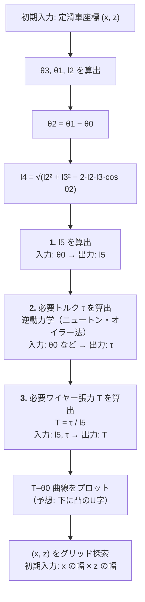

# ワイヤー駆動関節の運動学と定滑車配置の検討

- 出典: 手書き検討ノート（Goodnotes、全3ページ）を Markdown 化したもの
  — 原本: [`ワイヤー駆動関節の運動学と定滑車配置の検討_手書きノート.pdf`](ワイヤー駆動関節の運動学と定滑車配置の検討_手書きノート.pdf)（同ディレクトリに併置）
- 変換日: 2026-08-04
- 目的: ワイヤー駆動関節において「必要トルク τ」から「必要ワイヤー張力 T」を求める運動学を定式化し、
  定滑車（固定プーリー）の最適な取り付け位置を決定するための検討
- 関連: [`my_ak45/quadruped_prep_ja.md`](../quadruped_prep_ja.md)（ワイヤー駆動4脚ロボットに向けた準備メモ）

> **注記**: 本ドキュメントの「第1部」は手書きノートの内容をそのまま構造化したものです。
> 「第2部」以降は、そのノートに対する検討・レビュー意見であり、原ノートには含まれていません。
> 原ノート由来の記述と後から追加した考察を混同しないよう、セクションで明確に分離しています。

---

# 第1部: 手書きノートの内容（原文の構造化）

## 1. 記号の定義

### 定数

| 記号 | 意味 | 単位 |
|---|---|---|
| `g` | 重力加速度（9.8） | m/s² |
| `M` | リンク質量 | kg |
| `l1` | リンク長さ | m |
| `l2` | 関節から定滑車までの距離 | m |
| `l3` | 関節からワイヤー固定位置までの距離 | m |
| `θ1` | 鉛直下向き（関節基準座標）と定滑車の位置のなす角 | rad |

### 変数

| 記号 | 意味 | 備考 |
|---|---|---|
| `θ0` | 関節角度 | 鉛直下向きを `θ0 = 0°`、反時計回りを正とする |
| `θ2` | `θ2 = θ1 − θ0` | 関節を頂点とする、定滑車方向とワイヤー固定点方向のなす角 |
| `l4` | ワイヤー長さ（定滑車の接点〜ワイヤー固定位置） | 余弦定理で算出 |
| `l5` | 張力 T のモーメントアーム（関節からワイヤー作用線への垂線長） | m |
| `τ` | 必要トルク（入力） | Nm |
| `T` | 必要ワイヤー張力（出力） | N |

座標系は x–z 平面（紙面）で、y 軸は紙面奥向き（図中の「軸 ⊗」）、`+θ` は反時計回り。

## 2. ワイヤー長さ l4 の算出（余弦定理）

三角形の頂点は、関節 O・定滑車の接点 P・ワイヤー固定位置 A の3点。
`|OP| = l2`、`|OA| = l3`、頂点 O における挟角が `θ2` なので、対辺 `|PA| = l4` は余弦定理から：

```
l4 = √( l2² + l3² − 2·l2·l3·cos θ2 )
```

（一般形の余弦定理: `a² = b² + c² − 2bc·cos θ`、`a = √(b² + c² − 2bc·cos θ)`）

## 3. モーメントアーム l5 の算出（三平方の定理からの導出）

ノートでは、三角形の高さ `d` を三平方の定理から導出している。
底辺 `a`、他の2辺 `b`・`c`、高さ `d`、底辺上の分割点までの距離 `x` とすると：

```
b² = d² + x²          c² = d² + (a − x)²
d² = b² − x²          d² = c² − (a − x)²

b² − x² = c² − (a − x)²
b² − x² = c² − (a² − 2ax + x²)
b² − c² + a² = 2ax

x = (b² − c² + a²) / (2a)

d = √( b² − ( (b² − c² + a²) / (2a) )² )
```

この一般形に `a = l4`（底辺＝ワイヤー）、`b = l3`、`c = l2` を代入して：

```
l5 = √( l3² − ( (l3² − l2² + l4²) / (2·l4) )² )
```

なお、平方根の差の形は `√(A² − B²) = √((A − B)(A + B))` と因数分解できる旨もノートに併記されている。

## 4. トルク τ とワイヤー張力 T の関係

トルクの定義 `τ = F × r` より、張力 T がモーメントアーム l5 に作用するので：

```
τ = T · l5
```

したがって、必要トルク τ を発生させるのに必要な張力は：

```
T = τ / l5
```

- 入力: `τ`（必要トルク）
- 出力: `T`（必要ワイヤー張力）

## 5. ノートに記された疑問点（第2ページ）

### 5-1. 未解決の疑問

- **プーリー半径と、トルク τ・ワイヤー長さ l4 の関係性**
- **動滑車の導入有無**（力の増幅が必要か）
- **パラメータが多すぎる**（質量 M、外力 F なども絡む）

### 5-2. プーリー回転方向とワイヤーの繰り出し／巻き取り

微小変化後の状態を `θ0'`、`l4'` とすると：

| 条件 | ワイヤーの挙動 |
|---|---|
| `l4' − l4 > 0` | 出す（緩める） |
| `l4' − l4 < 0` | 巻き戻し |

### 5-3. 定滑車・動滑車の組み合わせ

ノート第2ページでは、定滑車（定）と動滑車（動）の配置バリエーション ①②③ が図示されている。
定滑車のみの構成から、動滑車を経由させる構成、さらに複数段に重ねた複滑車（多段）構成までを比較検討する意図の図。
力の増幅率（＝必要張力の低減）と、ワイヤー繰り出し量の増加とのトレードオフを見るための整理。

## 6. 定滑車の最適位置の探索（第3ページ）

### 6-1. 問いの定義

> **最適な定滑車（の接点）の位置は？**

具体的には以下を明らかにしたい：

- `θ1`・`l2`・`l3`・`l4` の関係性
- `l2 > l3` か、`l2 = l3` か、`l2 < l3` か？ **どれがトルクの増減が最も少ないか（負担が少ないか）？**
- `θ1` の角度は何度が良いか？

### 6-2. 初期入力から幾何量への変換

定滑車の接点の座標を `(x, z)` と定義し、これを初期入力（探索変数）とする。

```
x = l2·cos θ3        z = l2·sin θ3

θ3 = atan(z / x) = atan2(z, x)

θ1 = θ3 + 90°

l2 = √(x² + z²)
```

> **注**: 原ノートでは `atan2(x, z)` および `l2 = x² + z²` と記されているが、
> それぞれ `atan2(z, x)`（引数順）、`l2 = √(x² + z²)`（平方根）の書き落としと判断し、
> ここでは訂正して記載した。詳細は「第2部 7-1」を参照。

そこから、前述の式に接続する：

```
θ2 = θ1 − θ0
l4 = √( l2² + l3² − 2·l2·l3·cos θ2 )
```

### 6-3. 算出パイプライン（3ステップ）



1. **各角度 θ0 の時の l5**（ワイヤー長さが分かる）— 入力: `θ0`、出力: `l5`
2. **各角度 θ0 の時の τ（必要トルク）を算出** ← 逆動力学（ニュートン・オイラー法）— 入力: `θ0` など、出力: `τ`
3. **各角度 θ0 の時の T（必要ワイヤ張力）を算出** — 入力: `l5`, `τ`、出力: `T = τ / l5`

### 6-4. 期待される結果

`T` を縦軸、`θ0` を横軸に取ったグラフは、**下に凸のU字型になると予想**（ノートに「予想」と明記）。
`x` の幅 × `z` の幅でグリッド探索し、どの定滑車位置が最も張力負担を抑えられるかを比較する。

> **検討結果**: このU字予想は**常に成り立つわけではない**ことが数値確認で判明しました。
> 詳細は「第2部 8-6」を参照。

---

# 第2部: 検討・レビュー意見

以下は原ノートに対する検討意見であり、ノート自体には含まれていない内容です。
数式・アプローチとも大筋で正しく、進め方も妥当と考えます。その上で気になった点を挙げます。

## 7. 数式・記法に関する指摘

### 7-1. 第3ページの2箇所の書き落とし（実装時に必ず影響する）

| 箇所 | ノートの記載 | 正しい形 | 影響 |
|---|---|---|---|
| `θ3` の算出 | `atan2(x, z)` | `atan2(z, x)` | NumPy/C の `atan2` は `atan2(y, x)` の引数順。逆にすると `θ3` が `90° − θ3` になり、全ての角度がずれる |
| `l2` の算出 | `l2 = x² + z²` | `l2 = √(x² + z²)` | 平方根の書き落とし。そのまま実装すると `l2` が二乗値になり、余弦定理の結果が完全に破綻する |

いずれも手書きゆえの書き落としと思われますが、**コード化の際に最も混入しやすいバグ**なので明記しておきます。

### 7-2. l5 の導出は正しいが、大幅に簡単化できる

現在は「三角形の高さ」を三平方の定理から導出していますが、**三角形の面積を2通りに表す**方が近道です。

```
面積 = (1/2)·l2·l3·sin θ2 = (1/2)·l4·l5

∴  l5 = l2·l3·sin θ2 / l4
```

- 数学的には現在の式と完全に同じ結果になります（同値であることは数値検証で確認すべき）
- こちらの方が **特異点の挙動が直感的に読める**：`sin θ2 → 0` すなわち `θ2 → 0` または `θ2 → π` のとき `l5 → 0`
- `sin` がそのまま現れるので、後段の最適化（`θ0` 掃引・`T–θ0` プロット）でも扱いやすい
- 平方根の中身が負になる数値誤差の心配もない（現在の式は `l3²` から大きな値を引くため、丸め誤差で微小な負値になりうる）

**推奨**: 実装では簡単化した式を使い、テストとしてノートの式との一致を数値的に確認する。

## 8. 設計上の重要な指摘

### 8-1. ワイヤーは「引く」方向にしか力を出せない（`T ≥ 0` 制約）

**これが最も重要な指摘だと考えます。**

定滑車1本だけのワイヤーは張力しか出せません（押せない）。したがって、必要トルク `τ(θ0)` が
**符号反転する**（関節を両方向に駆動する必要がある）場合、単一ワイヤーでは片方向しかカバーできません。

第2ページの「動滑車の導入有無」という疑問は、力の**増幅**（①②③の複滑車構成）を検討されているように
見えますが、双方向駆動が必要なら本質的には別の解が要ります：

- **拮抗（アンタゴニスト）構成**: ワイヤー2本を対向配置（生体の屈筋・伸筋に相当）
- **片側ワイヤー＋復元要素**: ワイヤー1本＋バネ、または重力による復元を利用

どちらを採るかで **最適化の目的関数そのものが変わる**（後述 10-2）ため、
定滑車位置の探索を始める前に決めておく必要があります。

### 8-2. `l5 → 0` 近傍の特異点（張力発散）

`θ0` が動くと、ワイヤーが `l3` 方向とほぼ一直線になる瞬間（`θ2 ≈ 0` または `θ2 ≈ π`）で `l5 → 0` となり、
同じ `τ` を出すのに必要な `T = τ/l5` が**発散**します。

第3ページで予想されている「`T–θ0` は下に凸のU字」という形状は、**この特異点を可動範囲の外に
押し出せている場合の話**です。可動範囲設計時には `l5` の最小値が実用上十分な大きさかを必ず確認すべきです。

**推奨**: 定滑車配置 `(x, z)` の最適化では、単に `max T` を最小化するだけでなく、
**`l5` の最小許容値を制約条件に入れる**。

### 8-3. ワイヤーとリンクの干渉（幾何的な非干渉制約）

`l3` のオフセット方向によっては、`θ0` が可動範囲を掃引する間に **ワイヤーがリンク本体と交差してしまう**
配置がありえます。定滑車位置の最適化 `(x, z)` にこの非干渉制約を入れないと、
数値上は最適でも**実機で組めない配置**が選ばれる可能性があります。

### 8-4. 「パラメータ多すぎ!!」への対処 — まず準静的モデルから

質量 `M`・外力 `F` を含むニュートン・オイラー法の逆動力学は正しい方向ですが、
**最初のプーリー配置比較（`l2 > l3` か `l2 = l3` か等）には過剰**です。

重力トルクのみの準静的モデルで十分に傾向がつかめます：

```
τ_gravity(θ0) = M · g · (l1/2) · sin θ0        （重心がリンク中央にある場合）
```

> **注（θ0規約について）**: この式は原ノートの `θ0=0`＝鉛直下向き規約（第1部1節）に基づく。
> 後述 A-1 で `θ0=0` を「x軸正方向（水平）」に変更したため、A-1以降（フェーズC-1等）では
> `sin` ではなく `cos` 版（`τ_gravity = M·g·l_com·cos θ0`）を使う。ここ（8-4）は原ノートに
> 対するレビュー時点（A-1確定前）の記述としてそのまま残している。

- 外力・動力学項（慣性、コリオリ、遠心力）は**後段の精密化**として追加する
- まずは形状比較（`l2/l3` 比と `T(θ0)` 形状の関係）を単純化したモデルで**速く回す**
- パラメータが減れば、結果の解釈も容易になり「なぜこの配置が良いのか」が説明できる

### 8-5. `l2` と `l3` の関係 — モーメントアームには厳密な上界がある

ノートの問い「`l2 > l3` か `l2 = l3` か `l2 < l3` か」に対して、
簡単化した式 `l5 = l2·l3·sin θ2 / l4` から**解析的に答えが出ます**。

`l5²` を `u = cos θ2` の関数として微分して極値条件を解くと：

```
l2·l3·u² − (l2² + l3²)·u + l2·l3 = 0
∴  u = l2/l3  または  u = l3/l2
```

`|u| ≤ 1` を満たす有効な根は `u = min(l2,l3) / max(l2,l3)` のみ。したがって：

> **`l5` は `θ2 = arccos( min(l2,l3) / max(l2,l3) )` で最大となり、その最大値は `l5_max = min(l2, l3)`**

**幾何的な意味**: `cos θ2 = l3/l2`（`l2 > l3` の場合）は、`OP` の `OA` 方向への射影長が
ちょうど `l3` になる条件、すなわち **頂点 A（ワイヤー固定点）で直角になる**ことを意味します。
このとき関節からワイヤー作用線への垂線の足が A に一致するので、`l5 = |OA| = l3` となります。

#### これが意味する設計上の帰結（重要）

1. **モーメントアームは `min(l2, l3)` を超えられない。**
   `l3 < l2` の場合、定滑車を遠ざけて `l2` をいくら大きくしても、
   **達成可能な `l5` の上限は `l3` のまま変わりません。**
   張力を下げたいなら、まず **`l3`（関節からワイヤー固定位置までの距離）を大きく取る**のが本質的。
2. **`l2 = l3`（二等辺構成）は最大値が退化する。**
   `l2 = l3 = l` のとき `l5 = l·cos(θ2/2)` となり（数値検証済み）、
   `θ2 ∈ (0, π)` で**単調減少**します。上限 `l` に達するのは `θ2 → 0` の極限だけで、
   そこでは同時に `l4 → 0`（ワイヤー長ゼロ）となり物理的に成立しません。
3. **したがって `l2 ≈ l3` は避けるべき。** `l2` と `l3` に適度な差をつけ、
   実際の可動域が `θ2* = arccos(min/max)` の近傍に来るよう `θ1` を設計するのが定石。

> **訂正記録**: 本ドキュメントの初稿では「`l2 = l3` だと `θ2 = 90°` 付近で `l5` が最大化し、
> `T(θ0)` が対称なU字になる」と記述していましたが、これは**誤り**でした。
> 上記の解析と数値検証（`l5` 2式の一致を20,000点で確認、`l5_max = min(l2,l3)` と
> `θ2* = arccos(min/max)` を複数条件で確認）により訂正しています。

### 8-6. 「`T–θ0` はU字になる」という予想は保証されない

ノート第3ページの「予想: U字」について、準静的モデル（重力のみ）で数値確認したところ、
**試したパラメータ範囲では単調増加/減少になり、U字にはなりませんでした。**

理由: `T(θ0) = τ(θ0) / l5(θ0)` は2つの関数の比であり、

- `τ_gravity(θ0) = M·g·(l1/2)·sin θ0`（原ノート規約。A-1以降は `cos` 版、下記注参照）は
  `θ0 = 90°` に向かって単調増加（`θ0 ∈ [0°, 90°]` の場合）
- `l5(θ0)` は `θ2 = θ1 − θ0` を通じて `θ0` に依存し、`θ2*` を境に増減が変わる

この2つの積み重ねで形状が決まるため、**U字になるかどうかは `θ1` と可動域の取り方次第**です。
U字（内部に極小を持つ）になるのは、可動域内で `l5` の増加が `τ` の増加を上回る区間と
下回る区間の両方が存在する場合に限られます。

> **注（θ0規約について）**: 8-4 と同様、上記の `sin θ0` は原ノート規約（`θ0=0`＝鉛直下向き）
> によるもので、A-1確定後の `θ0=0`＝x軸正方向規約では `cos θ0` に置き換わる。
> `sin`/`cos` いずれの規約でも「2つの単調関数の比で形状が決まる」という本節の結論自体は変わらない。

**注意点**: フェーズCで U字にならなかったとしても、**それは異常ではありません**。
「U字にならない＝実装ミス」と早合点せず、`τ(θ0)` と `l5(θ0)` を**個別にプロットして**
どちらの寄与で形状が決まっているかを確認してください。

---

# 第3部: 課題解決の推奨順序

以下、依存関係の順に並べています。**各フェーズを完了してから次に進む**ことを推奨します
（特にフェーズA は、後戻りコストが最も大きい部分です）。

## フェーズA: 設計判断（コードを書く前に決める）

### A-1. 座標系・符号規約の確定

**やること**: `θ0 = 0` の基準（鉛直下向き）、正回転の向き（反時計回り）、
`θ1` の測り方、`(x, z)` の原点（関節中心）を、図と文章で一意に固定する。

**注意点**:
- ノートでは `θ1` を「鉛直下向きと定滑車位置のなす角」と定義しつつ、
  第3ページでは `θ1 = θ3 + 90°`（`θ3` は x 軸から測った角）としている。
  **この2つの定義が整合しているかを最初に検算すること。**
  x 軸基準の `θ3` と鉛直下向き基準の `θ1` は 90° オフセットの関係にあるが、
  符号・回転方向まで含めて一致するかは要確認。
- ここが曖昧なままだと、後段の全ての数値が「なんとなく合っているが検証できない」状態になる。

**確定した規約（2026-08-06、手書き検討「構想ver2」に基づく）**:

座標系:
- 平面: x–z 平面。`x` は左方向、`z` は上方向、`y` は紙面手前方向（`⊙`）
- 回転: `+θ` は `y` 軸（手前向き）まわりの右手則に基づく反時計回り正
- 原点: 関節回転中心

角度・長さの記号は第1部から刷新した（対応関係に注意）:

| 新記号 | 定義 | 第1部との対応 |
|---|---|---|
| `θ0` | 関節角度。`x` 軸正方向を `θ0 = 0`、CCW を正 | 第1部の `θ0` と同じ角度概念だが、基準を「鉛直下向き」→「x軸正方向」に変更 |
| `α` | リンクと `l3` のなす角（独立パラメータ、機構で決まる定数） | 第1部には存在しない（第1部は `l3` がリンク軸上にある前提だった） |
| `θ1 = θ0 − α` | `x` 軸正方向と `l3`（関節→ワイヤー固定位置）のなす角 | 新設。第1部の「`θ1`」（鉛直下向き基準の定滑車角）とは別物なので注意 |
| `θ2` | `x` 軸正方向と `l2`（関節→定滑車接点）のなす角 | 第1部6-2の `θ3` に相当する角だが、算出式・符号規約が異なる（下記） |
| `θ3 = θ1 − θ2` | `l2` と `l3` のなす角（余弦定理の挟角） | 第1部の `θ2`（`= θ1 − θ0`、鉛直下向き基準）に相当 |

**第1部の `θ1`（鉛直下向き基準の定滑車角）とその算出式 `θ1 = θ3 + 90°` は廃止**し、以後使わない。
`θ0` の基準を鉛直下向きから x 軸正方向に変えたことで、`θ1`・`θ2` とも x 軸基準の角度だけで完結し、
90° 変換が不要になったため。

定滑車接点の座標変換（**`z` の符号に注意**）:

```
x = l2 cos θ2
z = − l2 sin θ2          # 単純な +l2 sinθ2 ではなく符号反転
l2 = √(x² + z²)
θ2 = atan2(−z, x)        # 逆変換（7-1 の atan2 引数順の指摘は x=右前提だったため、
                          #   x=左に変えた本規約ではこの形が正しい）
```

`z` の符号を反転させている理由: `x` 軸を左向きに取ったことで、`θ0`/`θ1`（リンク・ワイヤー固定位置側）と
`θ2`（定滑車側）を**単一の CCW 規約**に揃えるため。この規約では、定滑車のように `x` 軸より上
（`z > 0`）にある点は `θ2 < 0` になる（`x` 軸から見て下向きが正の回転方向にあたるため）。
`z = +l2 sinθ2` のまま使いたい場合は、代わりに `θ3 = θ2 − θ1` に変える必要がある
（`z` の符号と `θ3` の式は必ずセットで選ぶこと。両方を独立に選ぶと符号が破綻する）。

`l4`・`l5` の算出（挟角は必ず `θ3`。`θ2` ではないことに注意）:

```
l4 = √( l2² + l3² − 2 l2 l3 cos θ3 )        # 余弦定理
l5 = l2 l3 sin θ3 / l4                      # 三角形の面積を2通りに表して導出（7-2 と同じ手法）
```

`l5` は符号付きのまま扱う（後述 E-1 相当の決定）。第1部3節の平方根形式
（`l5 = √(l3² − ((l3² − l2² + l4²)/(2l4))²)`）は常に非負になるため、
`T ≥ 0` の実現可否判定など符号を要る場面では使わず、上記の `sin` 版を正式な式として採用する。

トルク・張力の関係（第1部から変更なし）:

```
τ = T · l5
T = τ / l5
```

**未確定・今後の検討事項**:
- `α` の具体的な値・機構上の実現方法（レバー/ホーンの有無、固定/可変）は未定。
  現時点では「リンク軸から角度 `α` オフセットした独立パラメータ」として扱う。
- 定滑車の座標 `(x, z)` 自体の探索・決定はフェーズD（本節ではなく後続フェーズ）で行う。

### A-2. 駆動方式の決定（単方向 or 拮抗）

**やること**: 8-1 の指摘を受けて、「1関節あたりワイヤー何本か」を決める。

**注意点**:
- **`τ(θ0)` の符号を先に確認する**。重力のみの準静的モデルで `τ_gravity = M·g·l_com·cos θ0` を
  可動域全体で評価し、符号が反転するなら単方向ワイヤーでは不可能。
- 拮抗2本にすると、定滑車が2個になり **最適化問題の次元が倍**になる（`(x1,z1)` と `(x2,z2)`）。
  この決定はフェーズDの探索空間を直接決めるので、必ずD の前に確定させる。
- 4脚ロボット全体では「脚数 × 関節数 × ワイヤー本数」でモーター数が決まる。
  `quadruped_prep_ja.md` の「8〜12モーター構成」という想定と整合するかを確認する。

### A-2 の数値検証結果（2026-08-07）

準静的モデル（重力のみ）で `τ_gravity(θ₀) = M·g·l_com·cos θ₀` を可動域全体で計算した結果：

| 可動域 | τ の符号 | 判定 | 理由 |
|---|---|---|---|
| `θ₀ ∈ [-180°, 180°]` | 反転（±90° で + ↔ −） | **拮抗2本必須** | 一方向では対抗不可 |
| `θ₀ ∈ [-90°, 90°]`（典型的な脚） | 常に `≥ 0` | **単方向1本OK** | 負荷がいつも一方向 |

**物理的な意味**（座標系 A-1 確定規約 に基づく）:
- θ₀ = 0°（リンク左向き、鉛直下向きではない）→ τ = 最大 = M·g·l_com
- θ₀ = ±90°（リンク垂直）→ τ = 0 Nm（**平衡点**。`wire_statics` の数値確認では
  `θ₀ = +90°` が安定平衡、`θ₀ = -90°` が不安定平衡）
- θ₀ = 0° 近傍で τ は最大なので、特にこの領域での定滑車設計（フェーズD）に注意が必要

**（暫定）結論**: 脚の想定可動域が `θ₀ ∈ [-90°, 90°]` なら、準静的には**単方向ワイヤー1本で十分**。

> **この暫定結論は下記「A-2 再検討」で条件付きに改められました。** 上記の検証は
> **重力のみ・加速度ゼロ**の準静的モデルであり、慣性項・たるみ・モーメントアームの符号を
> 含んでいませんでした。結論の適用条件は下記を参照してください。

### A-2 再検討（2026-08-13）— 動力学・たるみ・速度上限を含めた3方式の定量比較

上記の準静的検証は「重力を支えて静止する分には1本で足りる」ことしか示していない。
以下の4点が判断材料から漏れていたため、動力学まで含めて再評価した。

1. **慣性項**: `τ_eff = τ_gravity − I·θ̈` の符号が反転すると `T < 0` が必要になり1本では不可能
2. **モーメントアームの符号**: 実現可否は `T = τ_eff / l5 ≥ 0` なので分母の符号も一定である必要がある
3. **たるみ**: 可動域端で `τ_gravity → 0` となり `T → 0`。実機ではワイヤーが滑車から外れる
4. **バネ復元案**: 8-1 が挙げていた「片側ワイヤー＋復元要素」が比較から漏れていた

#### 仮置きした動作仕様

| 項目 | 値 | 根拠 |
|---|---|---|
| リンク質量 `M` | 1.0 kg | 本ドキュメント既存の掃引と同じ仮値 |
| リンク長 `l1` / 重心 `l_com` | 0.30 m / 0.15 m | 同上 |
| 慣性 `I` | 0.030 kg·m²（`= M·l1²/3`） | 一様棒を関節端まわりで回した場合。点質量近似 `M·l_com²=0.0225` より現実的 |
| `l_anchor`（旧 `l3`） | 0.05 m | 既存の `l2×θ1` 掃引と同じ |
| 最低張力 `T_min` | 5 N | たるみ防止の仮値（実測根拠なし） |
| モーター速度上限 | 6.0 rad/s（出力軸側） | `MIT_Params["AK45-36"]["V_max"]`。実機ログで裏取り済み |
| モーター定格トルク | 8 Nm | `docs_mit_can/公式基本仕様.png` |

> **注**: `Mujoco/identification/` で同定済みの実測値（armature 0.0127 kg·m²、damping 0.0270、
> frictionloss 0.0977 Nm）は **AK45-36 単体（アーム無し）の特性**であり、上表の `I`
> （関節まわりのリンク慣性）とは別物。ワイヤー駆動ではモーターは関節から離れて配置されるため、
> ロータ慣性は関節の運動方程式に直接は入らない。ここでは使っていない。

#### 結果1: 決定的なのは慣性ではなく「モーター速度上限」だった

ワイヤーの繰り出し速度は `v = l5·θ̇`、モーター角速度は `ω = l5·θ̇/r_drum` なので、
関節の到達可能速度は **ドラム半径 `r_drum` に比例**する（`l5 = 0.05 m` 固定で計算）：

| `r_drum` | 関節角速度上限 | ±60°揺動の上限周波数 | `T=30N` 時のモータートルク |
|---|---|---|---|
| 10 mm | 1.20 rad/s | 0.18 Hz | 0.30 Nm |
| 20 mm | 2.40 rad/s | 0.36 Hz | 0.60 Nm |
| 40 mm | 4.80 rad/s | 0.73 Hz | 1.20 Nm |
| 60 mm | 7.20 rad/s | 1.09 Hz | 1.80 Nm |
| 80 mm | 9.60 rad/s | 1.46 Hz | 2.40 Nm |

一方、単方向1本が慣性で破綻する周波数は ±60° で **0.77 Hz**。したがって：

> **`r_drum < 42 mm` では速度上限が先に効き、単方向1本が破綻する速度域に物理的に到達しない。**
> **`r_drum > 42 mm` にして初めて「単方向では不可能」な領域に入る。**

モータートルクには大きな余裕がある（30 N でも 2.4 Nm、定格 8 Nm の3割）ので、
`r_drum` は速度が欲しければ上げられる。つまり **A-2 の答えは `r_drum` の選択と不可分**であり、
`r_drum` をフェーズE-2 に先送りしたままでは A-2 を確定できない。

#### 結果2: 単方向1本が破綻する周波数（振幅別、`l5=0.05m` 一定で近似）

| 振幅 | 破綻下限周波数 | その時の関節角速度 |
|---|---|---|
| ±30° | 1.44 Hz | 4.74 rad/s |
| ±45° | 1.06 Hz | 5.23 rad/s |
| ±60° | 0.77 Hz | 5.07 rad/s |
| ±80° | 0.40 Hz | 3.51 rad/s |
| **±90°** | **任意の非ゼロ周波数で破綻** | — |

> **A-3 の `θ₀ ∈ [-90°, 90°]` は、単方向1本とは原理的に両立しない。**
> 可動域端で `τ_gravity = 0` になるため、どんなにゆっくり動かしても慣性項が勝って `T < 0` が
> 必要になる。加えて、`θ_included` は `θ₀` と同じ幅だけ振れるので、幅ちょうど180°の可動域では
> `sin θ_included` が両端で必ず 0 になり、`l5 → 0`（特異点）にも触れる。
> **単方向1本を採るなら可動域を ±80° 以下に狭める必要がある。**

#### 結果3: 3方式の成立性と最大張力（振幅±60°、`l5=0.05m` 一定、`T_min=5N`）

| 揺動周波数 | 単方向1本 | 単方向＋バネ(1.0Nm) | 拮抗2本 |
|---|---|---|---|
| 0.00 Hz | OK (29.4 N) | OK (49.4 N) | OK (34.4 N) |
| 0.50 Hz | OK (30.0 N) | OK (50.0 N) | OK (35.0 N) |
| 0.75 Hz | **NG** (14.8%) | OK (52.5 N) | OK (37.5 N) |
| 1.00 Hz | **NG** (25.7%) | OK (59.6 N) | OK (44.6 N) |
| 1.50 Hz | **NG** (37.0%) | **NG** (26.5%) | OK (75.5 N) |
| 2.00 Hz | **NG** (42.3%) | **NG** (36.2%) | OK (118.9 N) |

（NG の括弧内は成立しない時間の割合）

定滑車配置を方式ごとに最適化した場合（グリッド探索 `x,z ∈ [-0.3,0.3]` 25点 × `α` 37点）：

| | 準静的 (f=0) | 揺動 f=1.0 Hz |
|---|---|---|
| 単方向1本 | **30.2 N** | 成立する配置なし |
| 単方向＋バネ(1.0Nm) | 69.4 N | 80.3 N |
| 拮抗2本（2本合計の最大） | 37.3 N | **53.1 N** |

#### 再検討の結論

- **バネ案は却下**。準静的で単方向の2.3倍（69 N vs 30 N）の張力を要しながら、1.5 Hz では
  結局破綻する。同じ周波数域では拮抗2本の方が張力も小さい（80.3 N vs 53.1 N）。
  「モーターを増やさずに済む」利点はあるが、張力とのトレードオフが割に合わない。
- **A-2 の判断は動作仕様に依存し、単独では確定できない**。以下の条件分岐になる：

  | 想定する脚の揺動 | 推奨方式 | 付随して必要な決定 |
  |---|---|---|
  | ~0.5 Hz 以下（準静的〜低速歩容） | **単方向1本**（30 N） | 可動域を **±80°以下**に狭める。`r_drum ≤ 40mm` |
  | 0.75 Hz 以上（走行・跳躍を含む） | **拮抗2本**（53 N @1Hz） | `r_drum` を 60mm 以上に拡大。フェーズD の探索次元は4に増える |

  > **訂正記録（2026-08-15）**: 上表「~0.5Hz以下→可動域±80°以下」は `T_min=0`（たるみ無視）
  > の破綻周波数（±80°で0.40Hz、結果2参照）を根拠にしていたが、`T_min=5N` を込みで
  > 検算すると **0.5Hz・振幅±80°の組み合わせは実際には infeasible**（`0.5Hz > 0.40Hz`
  > 破綻ライン、かつ端点付近で `T<T_min` になる）。`T_min=5N` 込みで0.5Hzにおいて
  > feasible な振幅の上限は概ね **±65°程度**（±60°はfeasible、±70°でNG）。
  > `my_ak45/wire_mechanism/assumed_params.py` の仮値選定時（下記）に検算し直した。
  >
  > **訂正記録2（2026-08-15、フェーズD実装後）**: 上表の周波数境界「0.75 Hz 以上→拮抗2本」も
  > 修正が要る。この境界は結果3の表（`l5=0.05m` 平坦近似、配置を最適化していない）に
  > 基づいていたが、フェーズDのグリッド探索で**定滑車配置を最適化すると 0.75 Hz でも
  > 単方向1本が成立する**（`maxT=38.9N`）ことが判明した。実際の境界は 0.75 Hz と 1.0 Hz の
  > 間にある。詳細は D-3 の「探索結果」節を参照。

- **したがって A-2 は「単方向1本で確定」から「暫定：単方向1本、ただし目標揺動周波数の確定待ち」に
  差し戻す**。フェーズD に進む前に、以下を決める必要がある（現時点で未定）：
  1. 脚の目標揺動周波数・振幅（歩容仕様）
  2. ドラム半径 `r_drum`（E-2 に先送りされていたが、A-2 と不可分）
  3. リンクの実慣性 `I`（CAD 由来の推定値でよい）
  4. 最低張力 `T_min`（たるみ許容量）

  > **仮決定（正式決定待ち、2026-08-15）**: ユーザーが歩容仕様を確定させるまでの間、
  > フェーズD以降の作業を止めないための仮値を `my_ak45/wire_mechanism/assumed_params.py`
  > に一元管理する形で設定した。**正式決定ではない**（このモジュールを書き換えれば
  > 依存スクリプトに反映される設計）。
  >
  > | 項目 | 仮値 |
  > |---|---|
  > | 目標揺動周波数・振幅 | 0.5 Hz・±60° |
  > | ドラム半径 `r_drum` | 40 mm |
  > | リンク実慣性 `I` | 0.030 kg·m²（一様棒近似、既存の仮値を継承） |
  > | 最低張力 `T_min` | 5 N（既存の仮値を継承、実測根拠なし） |
  >
  > 振幅は上記の訂正記録を踏まえ、`T_min=5N` 込みで0.5Hzにfeasibleな±80°ではなく
  > ±60°を採用している。`a2_drive_mode_comparison.py` は `assumed_params.py` の
  > `ASSUMED_LINK`/`ASSUMED_TENSION_MIN` を参照するよう更新済み。

- なお `θ₀ ∈ [-90°, 90°]` を維持するなら、**動作仕様によらず拮抗2本が必須**（結果2）。
  A-3 の可動域仮決めは、この点を踏まえて再考すべき。

#### 再現方法

上記の数値は `my_ak45/wire_mechanism/a2_drive_mode_comparison.py` で再現できる。

```bash
cd my_ak45 && python -m wire_mechanism.a2_drive_mode_comparison
```

物理モデル本体は `wire_mechanism/drive_modes.py`（`wire_statics.py` の符号規約を
動力学に拡張したもの）にあり、`tests/test_drive_modes.py` でユニットテスト済み。

### A-3. 可動域 `θ0 ∈ [θ_min, θ_max]` の仮決め

**やること**: 機構として必要な関節可動範囲を仮の数値で決める。

**選択肢**（A-2 の検証結果と連動）:

| 可動域 | 特徴 | 用途 |
|---|---|---|
| `θ₀ ∈ [-90°, 90°]` | A-2で検証済み。単方向1本で十分。τの変化が最大0.5倍程度（cos則）。 | **推奨** — 典型的な脚（垂直〜水平） |
| `θ₀ ∈ [-60°, 60°]` | より狭い範囲。τの最大が小さく、定滑車設計が容易。 | 軽量・高速脚向け |
| `θ₀ ∈ [-120°, 120°]` | より広い範囲。高いステップ動作が必要な場合。τが大きくなり、ワイヤー張力が増加。 | 高脚力設計必須 |

**仮決定**: 「4脚ロボット」の典型脚を想定し、**`θ₀ ∈ [-90°, 90°]` を採用**。

> **要再考（2026-08-13、A-2再検討より）**: この `±90°` という仮決定には2つの構造的な問題がある。
> 1. **単方向1本とは原理的に両立しない。** 可動域端で `τ_gravity = 0` になるため、
>    どれだけゆっくり動かしても慣性項が勝って `T < 0` が必要になる（A-2再検討の結果2）。
>    `±90°` を維持するなら動作仕様によらず拮抗2本が必須。
> 2. **幅ちょうど180°は特異点に必ず触れる。** `θ_included` は `θ₀` と同じ幅だけ振れるので、
>    `sin θ_included` が両端で 0 になり `l5 → 0`（8-2 の特異点）が避けられない。
>    準静的なグリッド探索（`T_min=0`）でも `[-90°,90°]` では全域成立する配置が存在せず
>    （最良で 99.7%、`maxT=34.3N`）、`[-85°,85°]` に1段狭めるだけで 100%（`maxT=32.3N`）になる。
>
> 上記1と2は別の制約である点に注意（1は慣性による動的な制約、2は幾何のみによる静的な制約）。
> 2 を回避するだけなら `±85°` で足りるが、1 も満たすには揺動周波数との兼ね合いが要る
> （`±80°` なら 0.40 Hz まで、`±60°` なら 0.77 Hz まで）。
> いずれにせよ上表の「`[-90°,90°]` = 推奨」という評価は、この2点を反映していない。

**注意点**:
- 後から変更可能。フェーズDのグリッド探索時に、この範囲で定滑車の最適配置を探す。
- 実装時は定数化せず、設定ファイル（config.yaml 相当）で外部設定化すること。
- `θ₀ = 0°` の近傍では τ が最大なので（A-2参照）、定滑車設計時には特に注意。

## フェーズB: 幾何モデルの実装と検証

### B-1. `l4`, `l5` の算出関数を実装

**やること**: `(x, z, l3, θ0)` を入力に `l4`, `l5` を返す純粋関数を書く。

**注意点**:
- **A-1で確定した規約に従うこと（7-1 の `atan2` 引数順の指摘は x=右前提の旧式向けであり、
  x=左に変えた現規約では `θ2 = atan2(−z, x)` が正しい。詳細は A-1 節参照）。**
- `l5` は A-1 で確定した符号付き簡単化式 `l5 = l2·l3·sin θ3 / l4` を採用する（挟角は `θ3`、`θ2` ではない）。
- 実機やCANとは無関係の純粋な幾何計算なので、**ハードウェア無しで完全に検証できる**。
  この段階でユニットテストを書いておくと、後段の全てが信頼できるようになる。

### B-2. 数値検証

**やること**: 既知の単純ケースで手計算と一致することを確認する。

**注意点**:
- **検証ケース**（下記は本ドキュメント作成時に実際に数値確認済み）。
  下表の `θ2` は検証当時の記号で、**A-1確定後の新記号では `θ3`（l2とl3のなす角）に相当する**
  （新 `θ2` は x軸と `l2` のなす角で意味が異なるので混同しないこと）。数式・数値自体は
  挟角の呼び方が変わっただけで有効。

  | 検証項目 | 期待値 | 確認結果 |
  |---|---|---|
  | `θ2 = 90°`, `l2 = l3 = 1` | `l4 = √2 ≈ 1.414214`, `l5 = 1/√2 ≈ 0.707107` | 一致 |
  | ノート元式と簡単化式の一致（ランダム20,000点） | 差 = 0 | 最大絶対差 `7.9e-13`（浮動小数点誤差の範囲） |
  | `θ2 → 0` の極限 | `l4 → |l2 − l3|`, `l5 → 0` | `θ2=0.01°` で `l4 = 0.300000`（`|0.8−0.5|`）, `l5 = 2.3e-4` |
  | `l5` の最大値 | `min(l2, l3)` | `l2=1.5, l3=0.5` → `l5max = 0.500000` |
  | `l5` 最大時の角度 | `arccos(min/max)` | `l2=1.5, l3=0.5` → `70.529°`（理論値と一致） |
  | `l2 = l3 = l` のとき | `l5 = l·cos(θ2/2)` かつ単調減少 | 最大絶対差 `3.1e-9`、単調減少を確認 |

- 上表の下3行は 8-5 の解析結果の裏取りでもあります。**実装後にこの表を再現できれば、
  幾何モデルは正しい**と考えてよいです。

## フェーズC: 準静的な τ → T の算出

### C-1. 重力のみの `τ(θ0)`

**やること**: `τ_gravity(θ0) = M·g·l_com·cos θ0`（`l_com = l1/2`、重心位置は仮定を明記）を実装する。

> **注（θ0規約について）**: A-1確定規約（`θ0=0`＝x軸正方向、`z=-l·sinθ`）のもとでは、
> ポテンシャル `V = M·g·l_com·sin θ0` から `τ_gravity = -dV/dθ0 = -M·g·l_com·cos θ0` … の
> 符号は仮想仕事の導出（`wire_statics.py` モジュールdocstring参照）に従う。実装
> （[`wire_statics.gravity_torque()`](../wire_mechanism/wire_statics.py)）は
> `+M·g·l_com·cos θ0` を採用しており、`θ0=-90°`（鉛直下向き）が安定平衡点になることを
> 数値確認済み。8-4/8-6 に書いた `sin θ0` は原ノート規約（`θ0=0`＝鉛直下向き）時代の式であり、
> ここでは使わない。

**注意点**:
- **逆動力学（ニュートン・オイラー法）はまだ実装しない**（8-4）。
  ここで動力学に踏み込むと、パラメータが増えて「配置の良し悪し」の比較が
  ノイズに埋もれる。
- 重心位置（リンク中央か否か）は仮定であり、**実機のリンク形状が決まったら要更新**。
  コード上でその旨をコメントに残す。
- **ここで A-2 の判断を数値で裏取りする。** 可動域全体で `τ` の符号を確認すること。
  数値確認例（`M=1kg, l1=0.3m` → `l_com=0.15m`、`cos` 版で再計算）:

  | 可動域 `θ0` | `τ` の範囲 | 判定 |
  |---|---|---|
  | `[−60°, +60°]` | `+0.735` 〜 `+1.470` Nm | 符号反転なし → 単方向可 |
  | `[0°, 90°]` | `0.000` 〜 `+1.470` Nm | 符号反転なし → 単方向可 |
  | `[10°, 80°]` | `+0.255` 〜 `+1.448` Nm | 符号反転なし → 単方向可 |

  `cos` 版では、鉛直下向き（`θ0 = ±90°`）を**またがない**限り符号は反転しない
  （A-1で `θ0=0` の基準を鉛直下向きからx軸正方向に変えたため、符号反転の境界も
  `θ0=0` から `θ0=±90°` に移っている点に注意）。A-2節の数値検証結果（2026-08-07、
  `θ0∈[-90°,90°]` で常に `τ≥0`）とも整合する。

### C-2. `T(θ0) = τ / l5` と可視化

**やること**: 1つの `(x, z)` に対して `T–θ0` 曲線をプロットする。

**注意点**:
- **`l5 = 0` でのゼロ除算に必ずガードを入れる**（8-2）。
  `l5` が閾値未満なら `T = inf` または `NaN` として扱い、プロット上で可視化する。
- ノートの「U字型になる」という予想が、実際にその通りになるかをここで確認する。
  **ならなかった場合、その理由（特異点が可動域内にある等）を突き止めてから次へ進む。**

**📊 対話的可視化ダッシュボード** (2026-08-07 実装):

🔗 **[Phase B/C Interactive Dashboard](https://claude.ai/code/artifact/b9b9d957-8f93-4ec3-b0d9-7e74587a1b87)**

リアルタイムに定滑車位置・リンク長・質量パラメータを調整し、以下の4つの曲線を同時に確認できます：

1. **ワイヤー長** `l_wire(θ₀)` — フェーズB（幾何）
2. **モーメントアーム** `l_moment_arm(θ₀)` — フェーズB（幾何、符号付き）
3. **重力トルク** `τ_gravity(θ₀)` — フェーズC（静力学）
4. **必要張力** `T(θ₀) = τ_gravity / l_moment_arm` — フェーズC（可行性判定付き）

パラメータ調整範囲（スライダー+数値入力）:
- 定滑車位置: x ∈ [-0.5, 0.5] m, z ∈ [-0.3, 0.3] m
- ワイヤー固定距離 `l_anchor`: [0.05, 0.5] m
- 質量 M: [0.1, 2.0] kg
- 重心位置 `l_com`: [0.05, 0.3] m
- 重力加速度 g: [1, 20] m/s²

可行性判定:
- **紫色** = 可行（`l_moment_arm` が閾値以上かつ `T ≥ 0`）
- **赤色** = 不可行（特異点近傍またはテンション負の領域）

**🖥️ Python/matplotlib による静的プロット出力**:

ドキュメント化・報告用に PNG ファイルとして出力するには、`wire_mechanism.plotting` モジュールを使用します：

```python
from wire_mechanism.plotting import plot_wire_geometry_phase_bc
import numpy as np

fig, axes = plot_wire_geometry_phase_bc(
    x=0.2,              # 定滑車 x 座標 [m]
    z=-0.15,            # 定滑車 z 座標 [m]
    l_anchor=0.2,       # ワイヤー固定距離 [m]
    theta_anchor_offset=0.0,  # リンク/ワイヤー固定位置のなす角 [rad]
    mass=0.5,           # リンク質量 [kg]
    l_com=0.1,          # 重心位置 [m]
    g=9.8,              # 重力加速度 [m/s²]
    theta_range=(-np.pi/2, np.pi/2),  # 可動域 [rad]
    num_points=200,     # サンプル点数
    output_file="phase_bc_analysis.png"  # 出力ファイルパス
)
```

dependencies に matplotlib が必要です：
```bash
uv sync  # pyproject.toml に matplotlib>=3.8.0 が記載済み
```

使用例（command line）:
```bash
cd my_ak45
python -c "from wire_mechanism.plotting import plot_wire_geometry_phase_bc; import numpy as np; plot_wire_geometry_phase_bc(0.2, -0.15, 0.2, 0.0, 0.5, 0.1, output_file='test.png')"
```

---

## フェーズD: 定滑車位置の探索（本題）

> **実装状況（2026-08-15）**: `my_ak45/wire_mechanism/pulley_placement_search.py` に
> **両方式とも実装済み**。
>
> | 関数 | 方式 | 探索次元 |
> |---|---|---|
> | `search_unidirectional_placement()` | 単方向1本 | 2（`x, z`） |
> | `search_antagonistic_placement()` | 拮抗2本 | 4（`x_a, z_a, x_b, z_b`） |
>
> A-2 が「暫定：単方向1本」のまま確定していないため、**どちらに転んでも探索できる状態**に
> してある。D-2のうち `l5_min`（8-2）と `T>=tension_min`（8-1）は実装済みだが、
> **8-3（ワイヤー・リンク非干渉）と物理的な取り付け可能性は未実装**（リンク形状の仕様が
> 本ドキュメントに無いため）。拮抗2本ではワイヤーが2本になるぶんこの未実装の影響が大きく、
> **ワイヤー同士の干渉も判定していない**。詳細はモジュール docstring 参照。

### D-1. 評価指標の定義

**やること**: 「最適」を数値で定義する。候補：

| 指標 | 意味 | 適する状況 |
|---|---|---|
| `max_θ0 T(θ0)` の最小化 | 最悪ケースの張力を抑える | ワイヤー破断・モーター定格が制約のとき（**推奨・第一候補**） |
| `T(θ0)` の分散/レンジの最小化 | トルク増減を平坦にする | ノートの「トルクの増減が最も少ない」に対応 |
| `mean T(θ0)` の最小化 | 平均消費を抑える | 発熱・電力が制約のとき |

**注意点**:
- ノートの問い「**どれがトルクの増減が最も少ないか（負担が少ないか）**」は、
  上表の2番目（分散最小化）と1番目（最悪値最小化）の**両方の意味を含みうる曖昧な表現**。
  どちらを採るかで最適な `(x, z)` は変わるので、**必ず一方に決める**（あるいは両方計算して比較する）。
- 複数指標を同時に見たい場合はパレート的に扱う（`max T` と `分散` の散布図を描く）。

> **実装上の補足（2026-08-15）**: 単方向1本では上表の1番目・2番目を両方計算する
> （`PlacementGridResult.max_tension` / `.tension_range`）。一方、**拮抗2本では
> レンジ指標を提供していない**。拮抗の張力配分は従動側を常に `T_min` に固定するため、
> 2本を合わせた最小張力が恒等的に `T_min` になり、レンジ = `max_θ0 T − T_min` と
> なって最悪値最小化と**順位同値**（＝独立した指標にならない）ことを数値確認したため。
> 拮抗でトルクの平坦さを別途評価したい場合は、この定義とは別の指標（例えば主動側だけの
> 張力レンジ、あるいは2本の張力の和の変動）を新たに定義する必要がある。

### D-2. 制約条件の定義

**やること**: 探索空間から除外すべき配置を明示する。

**注意点**: 以下は**全て実装すべき**制約です（数値最適解が実機で組めないと無意味）。
- **`l5_min > 閾値`**（8-2）— 可動域全体で特異点に近づかないこと。**実装済み**
  （`search_unidirectional_placement()` の `l_moment_arm_min`、`PlacementGridResult.singular`）
- **ワイヤーとリンクの非干渉**（8-3）— 可動域全体で交差しないこと。**未実装**
  （リンクの太さ・断面形状が本ドキュメントに定義されておらず、非干渉判定に必要な幾何情報が
  無いため。`feasible=True` を「実機で組める」の意味に使わないこと）
- **`T ≥ 0` の成立可否**（8-1）— 単方向構成を選んだ場合、`τ` の符号が反転しないこと。**実装済み**
  （`drive_modes.unidirectional()` を再利用、`PlacementGridResult.slack_or_reversed`）
- **物理的な取り付け可能性** — `(x, z)` がフレーム上に実在しうる位置か（機構の外形との整合）。
  **未実装**（同上、フレーム外形の仕様が無い）

### D-3. グリッド探索と可視化

**やること**: `x` の幅 × `z` の幅でグリッドを切り、各点で評価指標を計算してヒートマップ化する。

> **実装済み**: `search_unidirectional_placement()` / `search_antagonistic_placement()`
> （グリッド探索本体）と `plotting.plot_pulley_placement_heatmap()` /
> `plotting.plot_antagonistic_placement_heatmap()`（ヒートマップ、制約違反領域の色分け込み）。
> 8-5 の `l5_max = min(l2,l3)` が同じ関数呼び出しパターンで再現されることを
> `tests/test_pulley_placement_search.py::test_call_pattern_reproduces_8_5_moment_arm_upper_bound`
> で確認済み（下記注意点の「再現されなければコードに誤り」チェックに対応）。

#### D-3 探索結果（2026-08-15、両方式の比較）

`assumed_params.py` の仮値（リンク `M=1kg, l_com=0.15m, I=0.030kg·m²`、振幅±60°、`T_min=5N`）、
グリッド `x,z ∈ [-0.3,0.3]` 25点、`l_anchor=0.05m`、`α=0` 固定、`l5_min=0.005m` での
`max_θ0 T(θ0)`（各方式で配置を最適化した後の値）：

| 揺動周波数 | 単方向1本 | 拮抗2本 |
|---|---|---|
| 0.00 Hz（準静的） | **30.5 N** | 33.9 N |
| 0.50 Hz | **32.7 N** | 35.9 N |
| 0.75 Hz | **38.9 N** | 39.6 N |
| 1.00 Hz | 成立する配置なし | **54.4 N** |
| 1.50 Hz | 成立する配置なし | **96.5 N** |
| 2.00 Hz | 成立する配置なし | **155.4 N** |

- **拮抗2本は、単方向1本が成立する周波数域では常に不利**（プリテンション `T_min` の分だけ
  張力が上乗せされるため）。拮抗を選ぶ意味があるのは単方向が破綻する 1.0 Hz 以上。
- **新しい知見: 0.75 Hz でも単方向1本が成立する配置が存在する（38.9 N）。**
  A-2再検討の結果3の表（`l5=0.05m` 平坦近似）は 0.75 Hz で単方向を NG としていたが、
  あれは**定滑車配置を最適化していない**近似での判定だった。A-2再検討の「配置を最適化した
  比較」表は `f=0` と `f=1.0Hz` しか計算していなかったため、この中間が空白になっていた。
  したがって **A-2 の条件分岐「0.75 Hz 以上なら拮抗2本」の境界は、実際には
  0.75 Hz と 1.0 Hz の間**にある（本探索は `α=0` 固定＝A-2再検討より狭い探索空間なので、
  `α` も振ればさらに広がる可能性がある）。
- 1.0 Hz での最適配置は A=`(x=+0.125, z=+0.275)`、B=`(x=+0.050, z=-0.100)`。
  A候補71点 × B候補71点 = 5041組の総当たりで約0.2秒。

> **注**: 上表の「成立する配置なし」「成立する」はいずれも 8-1（`T>=T_min`）と
> 8-2（特異点）のみで判定した結果であり、**8-3（ワイヤー・リンク非干渉）と物理的な
> 取り付け可能性は含まれていない**（D-2参照）。実機で組めるかどうかは別途の検討が要る。

**注意点**:
- **まずは粗いグリッドで全体像を見る**（例: 20×20 = 400点）。
  細かくするのは有望な領域が見えてから。
- 制約違反の領域は**マスクして色分け**する（除外された理由が分かるように）。
- **`l2/l3` 比を横軸にした断面図も併せて描く**と、ノートの問い
  （`l2 > l3` か `l2 = l3` か `l2 < l3` か）に直接答えられる。
- 8-5 の解析結果（`l5_max = min(l2,l3)`、`l2 ≈ l3` は退化）が数値的に再現されるかを確認する。
  **再現されなければ、コードに誤りがある**（8-5 は解析的に導出済みかつ数値検証済みのため）。
- 参考として、準静的モデル（`M=1kg, l1=0.3m, l3=0.05m, θ0∈[10°,80°]`）で
  `l2 × θ1` を粗く振った結果を示す（`θ1∈{30°,60°}` は可動域内で `θ2` が負になり除外）。

  | `l2` \ `θ1` | 90° | 120° | 150° |
  |---|---|---|---|
  | 0.05 | 37.8 N | 50.5 N | 84.7 N |
  | 0.10 | 30.5 N | 38.9 N | 64.0 N |
  | 0.15 | 29.3 N | 35.7 N | 57.4 N |
  | 0.20 | 29.0 N | 34.2 N | 54.2 N |
  | 0.30 | 29.0 N | 32.9 N | 51.0 N |

  （各セルは `max_θ0 T(θ0)`）**`θ1 = 90°` 付近が最も張力負担が小さく**、`θ1 = 150°` に近づくほど
  悪化する。`l2` を増やすとどの `θ1` でも改善するが、伸び代は `θ1=90°` 付近で小さく
  （37.8→29.0N）、`θ1=150°` 付近で大きい（84.7→51.0N）——`θ1=90°` は元々
  `l5_max = min(l2,l3) = l3`（8-5）に近い値を可動域内で達成できているため、`l2` を伸ばす効果が
  相対的に小さいという理解と整合する。

  > **訂正記録（2026-08-13）**: 本節はかつて「`θ1=90°` 付近は `l5min` が小さくなり張力が
  > 跳ね上がる（`l2=0.30, θ1=90°` で `maxT=139N`）、`θ1=150°` 付近では `l2` によらず
  > `maxT≈29N` でほぼ横ばい」と記述しており、上表とは**符号・傾向とも正反対**でした。
  > 原因は、この掃引に使っていた `tau_gravity` が第4部の再現コード中で `sin θ0` のまま
  > （原ノート規約）実装されており、A-1確定後の `cos θ0` 規約（C-1節参照）に未更新だった
  > ことです。`sin`/`cos` は `θ0∈[10°,80°]` の範囲では `τ` の値域自体は近い集合になりますが
  > （`sin(10°)≈cos(80°)` 等の相補関係）、各 `θ0` に対する `τ` と `l5` の対応（ペアリング）が
  > 入れ替わるため、`max_θ0 T(θ0)` は一致しません。上表は `cos` 版で再計算した正しい値です。

## フェーズE: 精密化（フェーズDで方向が定まってから）

### E-1. 動力学項の追加

**やること**: 慣性・コリオリ・遠心力を含む逆動力学（ニュートン・オイラー法）に置き換える。

**注意点**:
- **フェーズDで選んだ配置が、動力学項を入れても妥当かを再確認する**用途。
  ここで配置が大きく変わるようなら、フェーズDの準静的仮定が不適切だったということ
  （＝高速動作が支配的な設計になっている）。
- 慣性パラメータは実機がないと精度が出ない。
  **MuJoCo SysID（`my_ak45/Mujoco/docs_syid/`）で同定した値をここに流し込む**のが本来の筋。
  現時点では CAD 由来の推定値で十分。

### E-2. プーリー半径とワイヤー繰り出し量の関係

**やること**: ノート第2ページの疑問「プーリー半径と τ・l4 の関係性」に答える。

**注意点**:
- これは **モーター角 ↔ 関節角のマッピング**の問題であり、
  `Δl4` とプーリー半径 `r` から必要なモーター回転角 `Δφ = Δl4 / r` が決まる。
- **AK45-36 のギア比（36:1）と可動域から、必要なプーリー半径の範囲が逆算できる。**
  `src/TMotorCANControl/mit_can.py` の `MIT_Params` にある `GEAR_RATIO` を参照。
- 関節角と `l4` の関係は**非線形**（余弦定理由来）なので、
  等速でモーターを回しても関節は等速で動かない。**制御側でこの非線形性を補償する必要がある**
  — これは将来の制御実装に直結する重要な帰結。

### E-3. 動滑車・複滑車の検討

**やること**: ノート第2ページ ①②③ の構成について、力の増幅率と繰り出し量の関係を整理する。

**注意点**:
- **フェーズDで「単純な定滑車1個では必要張力が過大」と判明した場合にのみ着手する。**
  先に検討すると、必要のない複雑さを抱え込む。
- 動滑車 n 個で張力は `1/(n+1)` 程度に下がるが、**ワイヤー繰り出し量は `(n+1)` 倍必要**になる。
  モーター側の回転数・可動域が足りるかを必ず確認する。
- 滑車が増えると摩擦損失・バックラッシ・組立精度の要求が増える。
  **4脚 × 複数関節に展開したときの現実的な組立可能性**を考慮すること。

---

## 第4部: 実装に向けたメモ

### 本ドキュメントとリポジトリの関係

- 本検討は `my_ak45/quadruped_prep_ja.md` の「今は着手しない方がいいもの: 歩容生成・逆運動学」の
  **前段階にあたる機構設計**であり、同メモの結論（「機構設計が固まってから制御を作る」）とは
  矛盾しない。むしろ、その「機構設計を固める」作業そのもの。
- フェーズB〜D は**実機・CANバスを一切必要としない純粋な数値計算**であり、
  ハードウェアが手元になくても完結できる。この点で、着手する優先度は高い。
- E-1 の慣性パラメータは `my_ak45/Mujoco/docs_syid/` の SysID 作業の成果物と接続する。

### 想定される成果物

フェーズB〜D を実装する場合、`my_ak45/` 配下に以下のような構成が考えられる
（本ドキュメント作成時点では**未実装**）：

| ファイル | 役割 |
|---|---|
| `wire_kinematics.py` | `l4`, `l5` の算出（フェーズB） |
| `wire_statics.py` | `τ(θ0)`, `T(θ0)` の算出（フェーズC） |
| `drive_modes.py` | 単方向/バネ/拮抗2本の動力学付き比較（フェーズA-2再検討） |
| `pulley_placement_search.py` | `(x, z)` グリッド探索と可視化（フェーズD、単方向1本限定） |

既存の `my_ak45/control_mit_can/lib/` は CAN 制御（実機駆動）用のモジュール群なので、
機構解析コードは**別ディレクトリに分ける**のが妥当（実機を必要としない／依存関係が異なるため）。

### 本ドキュメント中の数値の再現方法

第2部・第3部に記載した数値（`l5` 2式の一致、`l5_max = min(l2,l3)`、`τ` の符号反転、
`l2 × θ1` の粗い掃引結果）は、以下の関数定義のみで再現できます。
検証は使い捨てスクリプトで実施しており、リポジトリにはコミットしていません
（フェーズB を実装する際に、正式なテストとして書き直す想定）。

```python
import numpy as np

def l4_of(l2, l3, th2):
    return np.sqrt(l2**2 + l3**2 - 2*l2*l3*np.cos(th2))

def l5_of(l2, l3, th2):                      # 簡単化した式（7-2）
    return l2*l3*np.sin(th2)/l4_of(l2, l3, th2)

def l5_note(l2, l3, l4):                     # ノート原式（第1部 3節）
    return np.sqrt(l3**2 - ((l3**2 - l2**2 + l4**2)/(2*l4))**2)

def tau_gravity(th0, M=1.0, g=9.8, l1=0.30): # 準静的・重力のみ（C-1、A-1確定規約のcos版）
    return M*g*(l1/2)*np.cos(th0)
```

> **注**: この関数は A-1確定規約（`θ0=0`＝x軸正方向）に基づく `cos` 版。8-4/8-6 に登場する
> `sin` 版は原ノート規約（`θ0=0`＝鉛直下向き）時代のものなので、このコードの再現には使わない。

掃引に使ったパラメータ: `M=1.0 kg`, `l1=0.30 m`, `l3=0.05 m`, `θ0 ∈ [10°, 80°]`（701点）、
`l2 ∈ {0.05, 0.10, 0.15, 0.20, 0.30} m`、`θ1 ∈ {30°, 60°, 90°, 120°, 150°}`。
`θ1 ∈ {30°, 60°}` は可動域内で `θ2` が負になり `l5` が定義できないため結果から除外されています
（これ自体が 8-3／D-2 の「制約による除外」の具体例）。
